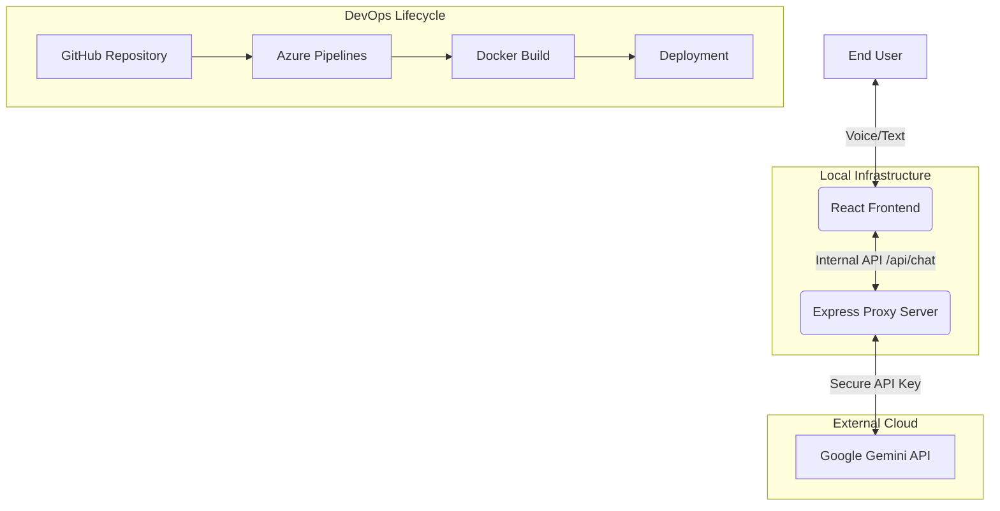

# Restaurant App - Knowledge Transfer (KT)

## 🏗 System Architecture & Workflow

Integrating advanced AI into a restaurant environment requires a robust multi-tier architecture. Below is the workflow diagram and technical breakdown.

### 📊 Application Workflow Diagram

---

## 🛠 Tech Stack Functionality Breakdown

### 1. Frontend: React + Vite
- **Component Based**: modular UI (Header, Footer, MenuItems).
- **Hooks (useState, useEffect)**: Manages real-time message updates and cart state.
- **Vite**: Used for lightning-fast HMR (Hot Module Replacement) during development.

### 2. Backend: Node.js + Express
- **Environmental Security**: Uses `dotenv` to load secrets.
- **Proxying**: Acts as a bridge between the frontend and Gemini, preventing CORS issues and securing tokens.
- **Static Hosting**: In production, Express serves the `dist/` folder containing the compiled React app.

### 3. AI: Google Gemini 2.0+
- **Prompt Engineering**: The server sends a `systemInstruction` to keep the AI in "Waiter Mode".
- **Context Awareness**: The entire chat history is sent back to Gemini so it remembers the user's previous orders.

### 4. Git Core Workflow
- **Branching Strategy**: Use `main` for production and `develop` for features.
- **Commit Pattern**: `feat: add AI voice feedback`, `fix: resolving cart sync issue`.

### 5. Dockerization
- **Dockerfile**: Uses a **Multi-Stage Build**.
  - **Stage 1 (Build)**: Installs dependencies and runs `npm run build`.
  - **Stage 2 (Production)**: Copies only the necessary files and runs the Node server on port 8080.
- **Efficiency**: Only production `node_modules` are included in the final image, keeping it lightweight.

### 6. Azure Pipeline (CI/CD)
- **Trigger**: Automatically runs on every push to `master` or `main`.
- **Steps**:
  1. Installs Node.js.
  2. Builds the project (`dist` folder).
  3. Publishes the build artifacts to Azure.
- **Deployment**: Can be extended to deploy directly to Azure Web Apps or a Kubernetes Cluster.

---

## 📱 UI Functional Elements
- **Speech Synthesis**: Converts AI text responses into audio for a natural experience.
- **Responsive Layout**: Designed for Kiosks (Large screens) and Personal devices (Mobile).
- **Dynamic Menu Filtering**: Items are categorized and filtered in real-time as the user navigates.
